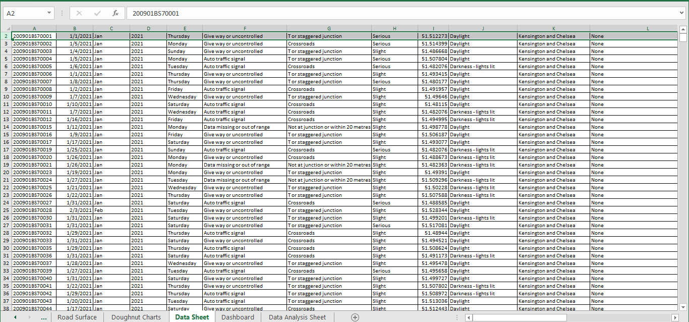
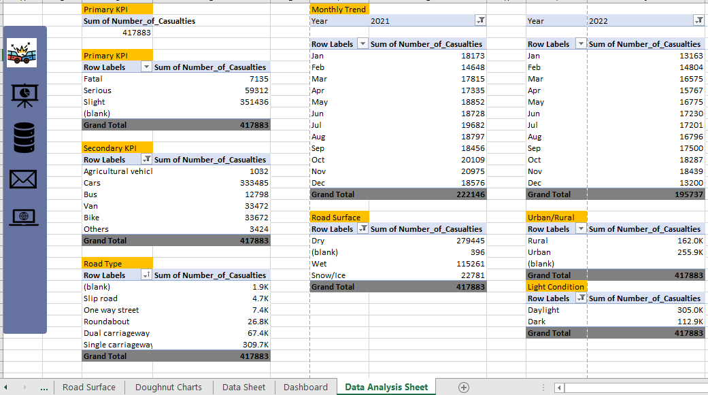
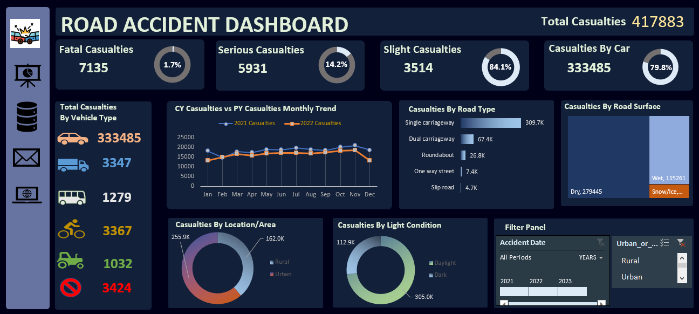

# Road Accident Analysis

___

## Introduction

The UK government amassed traffic data from 2021 and 2022, recording over three hundred and seven thousand accidents in the process and making this one of the most comprehensive traffic data sets out there. It's a huge picture of a country undergoing change.
### Content/Description
There is one .xlsx File in this set. Accidents are the primary ones and have references by Accident index to the casualties and vehicles tables. This might be better done as a database.
This Dataset contains 21 Features covering over  three hundred and seven thousand records. This dataset consists of various features like;
- **Accidental Latitude/ Longitude:** Location of Accident
- **Accident_Severity:** Accident Severity on the Scale of Slight, Serious and Fatal
- **Number_of_Vehicles:** Number of Vehicles Involved
- **Number_of_Casualties**: Number of Casualties in Accident
- **Light_Conditions:** Lighting Condition on the day of Accident
- **Weather_Conditions:** Weather Conditions on the day of the Accident
- **Road_Surface_Conditions:** Road Surface Conditions of Accidental Spot
- **Accident Date:** Date of Accidental Event
- **Vehicle Type:** Type of Vehicle involved in Accident
- **Area:** Urban and Rural Area

## Requirements

Client wants to create a Road Accident Dashboard for year 2021 and 2022 so that they can have insight on the below requirements:
- Primary KPI: Total casualties taken place after accident
- Primary KPIs: Total casualties and percentage of total with respect to accident severity and maximum casualties by type of vehicle
- Secondary KPIs: Total casualties with respect to vehicle type
-	Monthly trend showing comparison of casualties for current year and previous year
-	Maximum casualties by Road Type
-	Distribution of total casualties by Road Surface
- Relation between Casualties by Area/Location and by Day/Night

## Skills

Microsoft Excel is used throughout the project
- Data Cleaning and Processing
- Pivot Table

## Data Sheet

## Data Visualization

Build some custom charts using some formatting and place them into dashboard. The report comprises of 2 pages:
1.	Data Analysis Sheet and different KPIs
2.	Dashboard

You can [view](https://1drv.ms/x/s!AnWH7uDNTUCQglnmR7nyIeZQJcdm) and interact with the report [here](https://1drv.ms/x/s!AnWH7uDNTUCQglng0dMJgzf-PCGp)

## Data Analysis asheet with KPIs

## Dashboard

